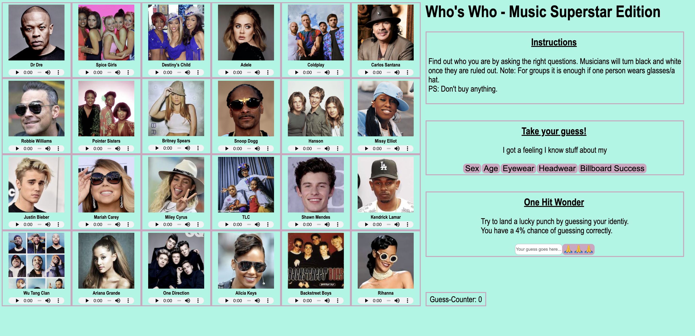

Who is Who - Single Player

>>>Project Title 
The Project is called Who is Who and it is a single player take on the classic multiplayer game "Who is Who"

>>>How to use the project
It is a game that runs in the browser - no need to install anything, just head to https://statuefilzball.github.io/who-is-who/ and give it a try. Or 100 tries. I aint judging.

>>>Project Description

The Project enables you to enjoy a game of Who is Who by youself, To do so, you are secretly assigned a character you have to find ­- no need for an opponent to draw a card for you! This process happens on window load, so you can play straight away!

To find out who you are, you have a set of 5 questions at your disposal:

1) Sex - inquire about your gender
2) Age - inquire about a self-selected age range. This question can be useful to ask multiple times to narow down
3) Eyewear - inquire whether your character is wearing glasses. In case of groups of people, one group member wearing glasses is sufficient to return true
4) Headwear - inquire whether your character is wearing a hat. In case of groups of people, one group member wearing a hat is sufficient to return true
5) Billboard Success - inquire how many billboard hot 100 hits your character had. This question can be useful to ask multiple times to narow down

One Hit Wonder: If you want to take a lucky guess or you are getting stuck, you can just guess which character you are. Be mindful about case sensitivity when entering your guess.

Other things to look out for: You might encounter surprising elements in this game. Carefully read the instruction and youll know what to do. Really, its four lines of instructions. Its not exactly Apples TOA <3

Note: This game makes use of sounds. It is encouraged to not set your audio to mute when playing :)

>>>About the code
The game is fueled by DOM Manipulation that automatically updates single or multiple nodes of the DOM depending on the course of action that you take. Your secret identity is chosen by selecting a random element out of the array of characters. It's totally not being logged in the console, so totally don't look in the console to get away with a 1 guess round :D